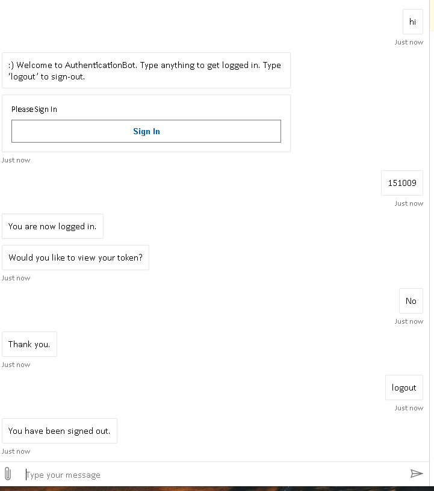
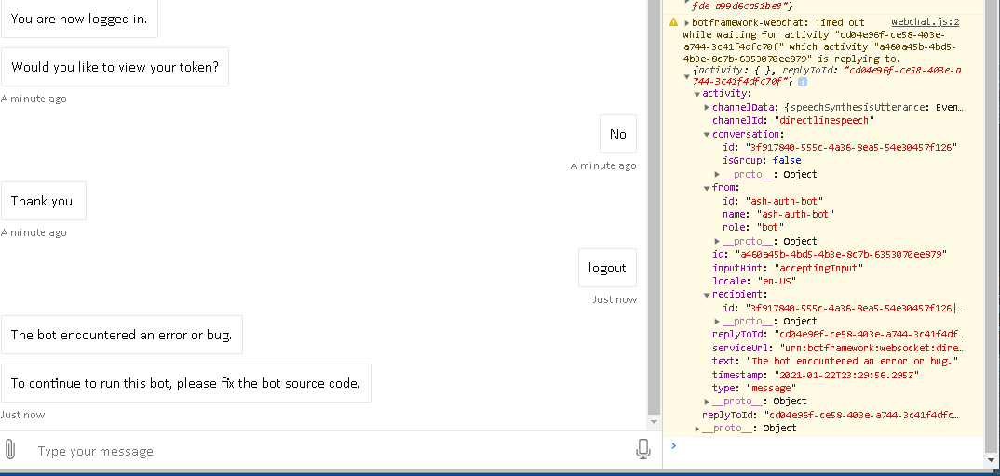
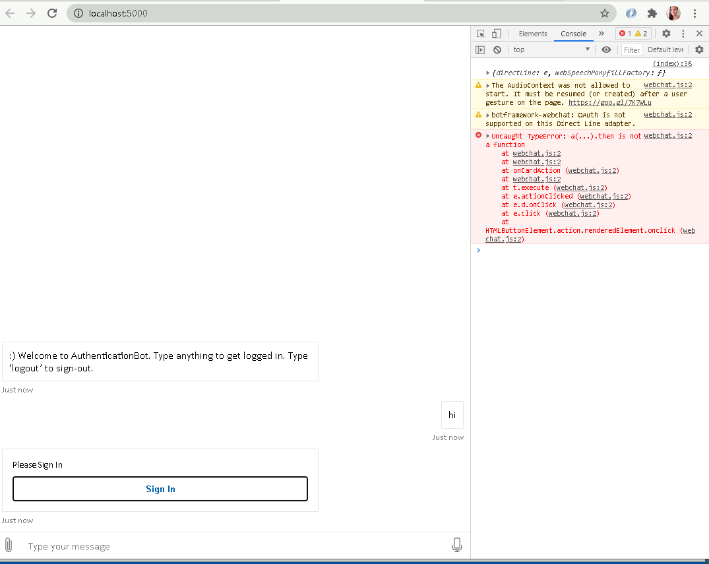
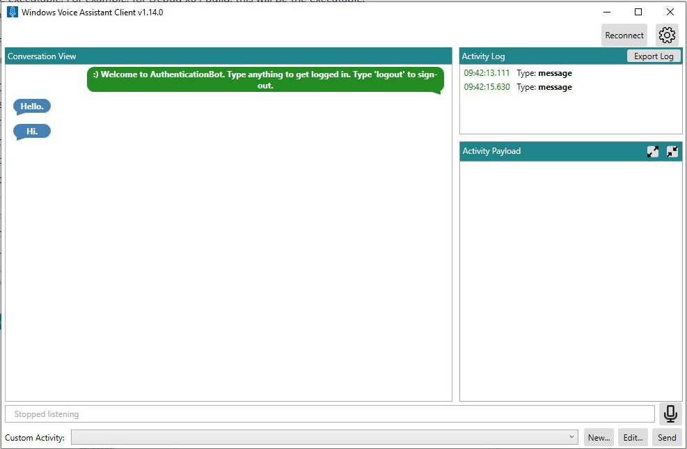
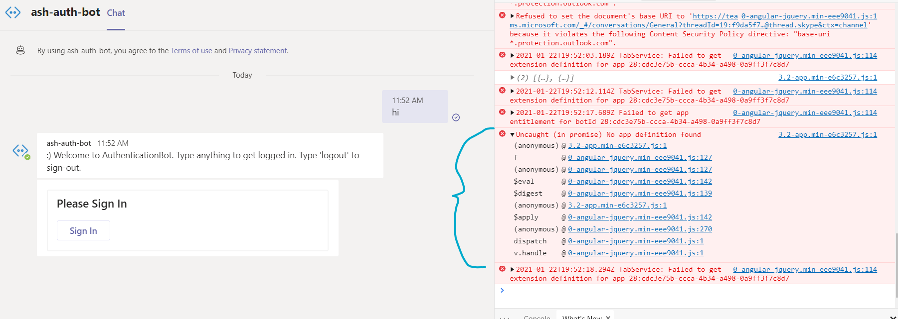

# Using DLS with Web Chat (latest, 4.11.x)

**Bot Used**: [C# 18.authentication-bot](https://github.com/microsoft/BotBuilder-Samples/tree/main/samples/csharp_dotnetcore/18.bot-authentication)

## Works

#### **Happy Path OAuthPrompt Conversation**



<details>
    <summary>Authentication with OAuthPrompt works in WC with "regular" DL</summary>
    
```html
    <script>
    (async function () {
        const res = await fetch('@settings.TokenURL', { method: 'POST' });
        const { token } = await res.json();

        window.WebChat.renderWebChat(
            {
                
                directLine: window.WebChat.createDirectLine({ token })
            },
            document.getElementById('webchat')
        );

        document.querySelector('#webchat > *').focus();
    })().catch(err => console.error(err));

</script>
```
</details>

____________________

## Doesn't Work

Following scenarios don't work. They fail in different ways.

<details>
    <summary>OAuthPrompt in WC (latest, 4.11.x) with DLS</summary>

```html
    <script>
      (async function() {
        const adapters = await window.WebChat.createDirectLineSpeechAdapters({
          fetchCredentials: {
            region: 'westus2',
            subscriptionKey: '7xxxxxxxxxxxxxxxxxxxxxxxxxxx320'
          }
        });

        console.log(adapters);

        // Pass the set of adapters to Web Chat.
        window.WebChat.renderWebChat(
          {
            ...adapters
          },
          document.getElementById('webchat')
        );

        document.querySelector('#webchat > *').focus();
      })().catch(err => console.error(err));
    </script>
```


* This is the result of the conversation when typing all responses, but still using the DLS adapter.
* Generally all spoken messages w/mic will continue the conversation just fine if the bot's response is just vanilla text. See following for exceptions/details.

1. Type anything to start the OAuthPrompt dialog, which should pull up a sign-in card
    * If I type a message like "hi", the OAuthPrompt sign-in card loads fine
    * If I use the mic and verbally say "hi", the OAuthPrompt sign-in card does not load and you'll get "The bot encounterd an error or bug."
        * Update: I don't know why verbally saying "hi" is now working, when it didn't  before. *sigh, the erractic, inconsistent behavior...*
2. Click sign-in
    * Note: saying "Sign in." verbally will not trigger any errors in neither browser nor bot consoles, but the bot will stop responding--can type in more responses without bot throwing, but no further responses from bot
3. Try to log out
    * Both typing "hi" and verbally saying "hi" will result in "The bot encountered an error or bug"
    * Errors in bot. But in browser console that has WC, it  has time out waiting for activity response error
    * 

</details>

<details>
    <summary>Older Version of WC (4.10.1) + DLS Test</summary>

* Testing for WC regression and seeing if the scenario of WC + OAuthPrompt + DLS scenario worked in the first place.
* Same code as previous WC + DLS test, but this time using WC ver. 4.10.1.
* It appears we didn't support this scenario initially, so our current 4.11.x's broken behavior isn't at least a regression.


</details>

<details>
    <summary>Windows Voice Assistant Client</summary>

Using the voice client suggested in the DLS docs, it looks like it can connect to the bot just fine, and speaks, however it doesn't seem to support OAuthPrompt, so I can't test sign-in/out behavior.



</details>

<details>
    <summary>Teams + DLS</summary>

I'm not even sure if Teams supports DLS--I asked Daniel, and he says he doesn't think so. But here's the test for it, just to try to compare behavior of another client that normally supports OAuthPrompt in a non-DLS scenario. Gets some kind of no app definition error.



</details>
